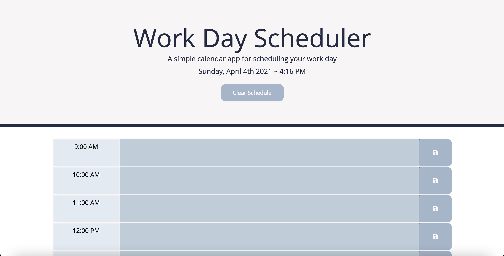
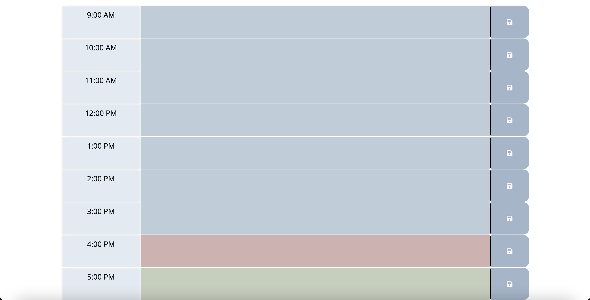

# day-planner

## Screenshot

## Description 

## Technologies Used 
- HTML + Font Awesome 
- CSS + Bootstrap 
- JS + jQuery
- Moment Librabry

## Deployed Application URL
[day-planner](https://ssharmin0029.github.io/day-planner/)